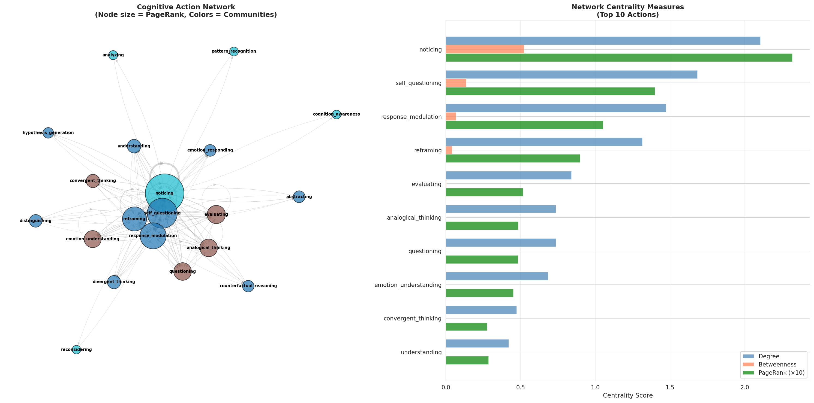

# Brije: Watching Minds Think (Condensed)

This repository provides a toolkit to detect 45 cognitive actions in real-time as a language model (Gemma 3 4B) generates text. Think of it as an fMRI for an AI's thought process.


## What It Does
- **Detects 45 Cognitive Actions**: Identifies thinking patterns like `analyzing`, `reconsidering`, `divergent_thinking`, and `self_questioning` using trained probes on the model's internal states.
- **Enables Multi-Agent Conversations**: Run simulations (e.g., therapy sessions, debates) between two AI agents and watch their cognitive strategies interact in real-time.
- **Provides an Analysis Suite**: A set of notebooks to analyze cognitive patterns in large datasets, including synchrony, network analysis, and predicting behavioral outcomes.

## Core Features
- **Real-Time Inference**: See cognitive actions light up as text is generated.
- **Multi-Agent GUI**: An interactive interface for running AI-to-AI conversations.
- **Advanced Analytics**: Scripts for deep analysis of cognitive patterns (tested on the AnnoMI therapy dataset).
- **Extensible**: Add new cognitive actions or fine-tune probes on your own data.
- **Hardware Agnostic**: Supports NVIDIA (CUDA), Apple Silicon (MPS), AMD (ROCm), and CPU.

## Getting Started

### The Easy Way: Google Colab
1. Open [`Brije_Full_Pipeline_Colab.ipynb`](./Brije_Full_Pipeline_Colab.ipynb).
2. Set runtime to GPU.
3. Run all cells. This takes ~3-4 hours to train all 45 probes.
4. Download your trained probes from the Colab environment.

### The Local Way (16GB+ VRAM GPU Recommended)
```bash
# 1. Install dependencies
pip install torch transformers nnsight h5py scikit-learn tqdm

# 2. Capture model activations (2-3 hours)
python src/probes/capture_activations.py \
    --model google/gemma-2-3b-it \
    --layer 27 \
    --device auto

# 3. Train all 45 probes (1-2 hours)
python src/probes/train_binary_probes.py \
    --activations data/activations/layer_27_activations.h5 \
    --output-dir data/probes_binary \
    --device auto

# 4. Run inference on a sample text
python src/probes/multi_probe_inference.py \
    --probes-dir data/probes_binary \
    --text "After reconsidering my approach, I began analyzing the problem differently."
```

## Example Outputs

We provide two different views of the cognitive action predictions. Full outputs for 30 sample texts are available in the linked files.

### View 1: Grouped by Action ([output_example_3.txt](./output_example_3.txt))
This view summarizes which actions were detected across all layers for a given text. It's useful for seeing the most prominent cognitive signals.

**Example 1 of 30**
```text
[1/30] Text:
"The quarterly numbers look... interesting. Revenue up 12%, but margins down 3%. Customer acquisition costs rising while retention rates plateau. Something doesn't add up here."
--------------------------------------------------------------------------------
Predictions grouped by action:
  ✓ 1. noticing                       (Layers 22, 23, 24, 25, 26, 27, 28, 29)  Count:  8  Max: 1.0000
  ✓ 2. analyzing                      (Layers 22, 24, 25, 26, 27, 28, 29)  Count:  7  Max: 1.0000
  ✓ 3. hypothesis_generation          (Layers 22, 23, 27     )  Count:  3  Max: 1.0000
  ✓ 4. evaluating                     (Layers 28             )  Count:  1  Max: 1.0000
  ✓ 5. pattern_recognition            (Layers 28             )  Count:  1  Max: 1.0000
```

**Example 2 of 30**
```text
[2/30] Text:
"What if we completely flipped the script? Instead of chasing the same customers everyone else wants, what about targeting the segment nobody's paying attention to?"
--------------------------------------------------------------------------------
Predictions grouped by action:
  ✓ 1. divergent_thinking             (Layers 21, 22, 23, 24, 25, 26, 27, 28, 29, 30)  Count: 10  Max: 1.0000
  ✓ 2. questioning                    (Layers 21, 29, 30     )  Count:  3  Max: 1.0000
  ✓ 3. convergent_thinking            (Layers 24, 27, 28     )  Count:  3  Max: 1.0000
  ✓ 4. noticing                       (Layers 28, 30         )  Count:  2  Max: 1.0000
  ✓ 5. reframing                      (Layers 26             )  Count:  1  Max: 0.9922
  ✓ 6. creating                       (Layers 22             )  Count:  1  Max: 0.9492
```

**Example 3 of 30**
```text
[3/30] Text:
"Last quarter's campaign... we spent $50K on social media ads, got 200 signups, but only 15 converted. That's a 7.5% conversion rate. Industry average is 12%. We're bleeding money."
--------------------------------------------------------------------------------
Predictions grouped by action:
  ✓ 1. noticing                       (Layers 23, 25, 26, 27, 28, 29, 30)  Count:  7  Max: 1.0000
  ✓ 2. evaluating                     (Layers 24, 25, 26, 27, 28, 29, 30)  Count:  7  Max: 1.0000
  ✓ 3. convergent_thinking            (Layers 26, 30         )  Count:  2  Max: 1.0000
  ✓ 4. abstracting                    (Layers 28, 29         )  Count:  2  Max: 1.0000
  ✓ 5. remembering                    (Layers 28             )  Count:  1  Max: 1.0000
  ✓ 6. questioning                    (Layers 30             )  Count:  1  Max: 1.0000
```
---

### View 2: Layer-by-Layer Breakdown ([output_example_4.txt](./output_example_4.txt))
This view shows the raw confidence scores for each detected action at each specific layer. It's useful for seeing how cognitive processes evolve through the model's depth.

**Example 1 of 30**
```text
[1/30] Text:
"The quarterly numbers look... interesting. Revenue up 12%, but margins down 3%. Customer acquisition costs rising while retention rates plateau. Something doesn't add up here."
--------------------------------------------------------------------------------
  Layer 21: hypothesis_generation(0.012)
  Layer 22: analyzing(1.000), noticing(1.000), hypothesis_generation(0.996)
  Layer 23: hypothesis_generation(1.000), noticing(1.000), questioning(0.009), zooming_in(0.003)
  Layer 24: analyzing(1.000), noticing(1.000), pattern_recognition(0.209)
  Layer 25: analyzing(1.000), noticing(1.000)
  Layer 26: analyzing(1.000), noticing(1.000)
  Layer 27: analyzing(1.000), hypothesis_generation(1.000), noticing(1.000), understanding(0.996), questioning(0.301)
  Layer 28: analyzing(1.000), evaluating(1.000), noticing(1.000), pattern_recognition(1.000)
  Layer 29: analyzing(1.000), noticing(1.000), pattern_recognition(1.000), questioning(1.000), understanding(0.785)
  Layer 30: analyzing(1.000), hypothesis_generation(1.000), noticing(1.000), questioning(1.000), understanding(1.000), evaluating(0.015)
```

**Example 2 of 30**
```text
[2/30] Text:
"What if we completely flipped the script? Instead of chasing the same customers everyone else wants, what about targeting the segment nobody's paying attention to?"
--------------------------------------------------------------------------------
  Layer 21: divergent_thinking(1.000), questioning(1.000), creating(0.002)
  Layer 22: divergent_thinking(1.000), creating(0.887), reframing(0.005)
  Layer 23: divergent_thinking(1.000), questioning(0.005)
  Layer 24: divergent_thinking(1.000), convergent_thinking(0.973)
  Layer 25: divergent_thinking(1.000)
  Layer 26: divergent_thinking(1.000), reframing(0.875)
  Layer 27: convergent_thinking(1.000), divergent_thinking(1.000)
  Layer 28: convergent_thinking(1.000), divergent_thinking(1.000), hypothesis_generation(1.000), noticing(1.000), questioning(0.957)
  Layer 29: divergent_thinking(1.000), questioning(1.000)
  Layer 30: divergent_thinking(1.000), noticing(1.000), questioning(1.000)
```

**Example 3 of 30**
```text
[3/30] Text:
"Last quarter's campaign... we spent $50K on social media ads, got 200 signups, but only 15 converted. That's a 7.5% conversion rate. Industry average is 12%. We're bleeding money."
--------------------------------------------------------------------------------
  Layer 23: noticing(1.000), evaluating(0.086)
  Layer 24: evaluating(1.000)
  Layer 25: evaluating(1.000), noticing(1.000)
  Layer 26: convergent_thinking(1.000), noticing(1.000), evaluating(0.875)
  Layer 27: noticing(1.000), evaluating(0.996)
  Layer 28: abstracting(1.000), evaluating(1.000), noticing(1.000), remembering(1.000)
  Layer 29: evaluating(1.000), noticing(1.000), abstracting(0.153)
  Layer 30: convergent_thinking(1.000), evaluating(1.000), noticing(1.000), questioning(1.000)
```
---
### Network Analysis Visualization
This graph shows the relationships between different cognitive actions, derived from analyzing 133 therapy transcripts. `noticing` is the central hub.



## What's in the Box?
- `src/probes/`: The core scripts for capturing activations, training probes, and running inference.
- `data/`: Where your captured activations and trained probes are stored.
- `third_party/`: Includes the multi-agent GUI (`liminal_backrooms`) and the dataset generator (`datagen`).
- `*.ipynb`: A series of notebooks for both running the pipeline (`Brije_Full_Pipeline_Colab.ipynb`) and for performing advanced analysis (`AnnoMI_*.ipynb`).
- `output/analysis_AnnoMI/`: Contains all generated charts, graphs, and analysis summaries from the notebooks.

## The Big Idea
By making an AI's cognitive processes visible, we can better understand how they "think," analyze their reasoning patterns for safety and alignment, and apply these insights to human domains like therapy, education, and collaboration.


